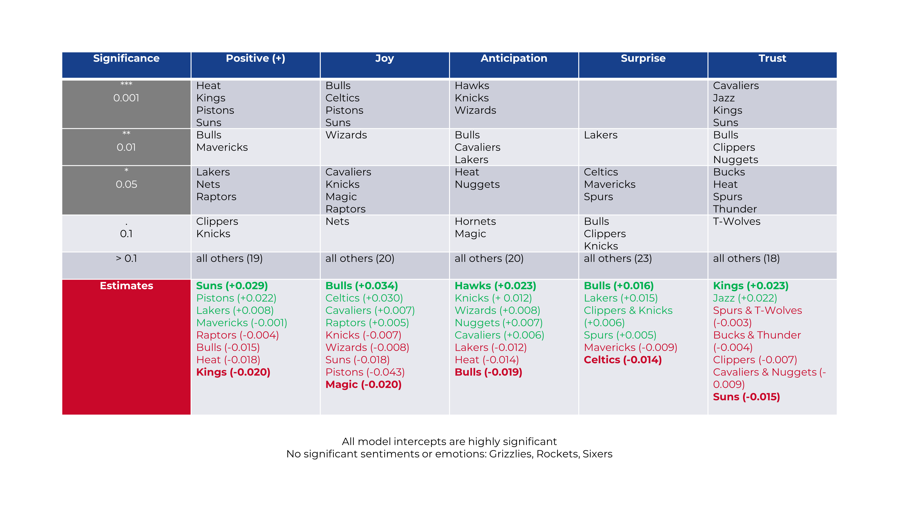

```{r setup, include=FALSE}
knitr::opts_chunk$set(echo = TRUE)

library(rlist)
library(modelsummary)
```

## Motivation

**One slide, motivating your project**

**Video Recording of your presentation must be less than 6 minutes long!**

* Bullets 
* Bullets

1. Numbered List
2. Numbered List

## Data

**One slide explaining the data** 

```{r, echo = FALSE, fig.align='center', out.width='45%'}
knitr::include_graphics('../output/SummaryTable.jpg')
```

## Methodology

**One slide explaining your methods**

Here's an equation... 

$$
y_i = x_i \beta + \varepsilon_i
$$

## Results

**One slide showing your main result**


```{r, echo = FALSE, results='asis'}


```


## Conclusion

**One slide with your concluding remarks**
The analysis revealed that the sentiments and emotions towards different NBA teams are not only different, but also ambivalent in its direction. There are no teams that are "purely" perceived in a negative or positive manner. This observation is accurate for every team except for the three franchises that didn't induce any significant Exemplary for this, the LA Lakers are the most "hated" franchise in this sample, yet they are also unlikely to be perceived in combination with angry or sad feelings. Recent success seems to be an important factor how teams are perceived on Twitter. Given this implication, marketers should exploit recent success in the league with their marketing campaigns to exploit this - for example after a big playoff win.